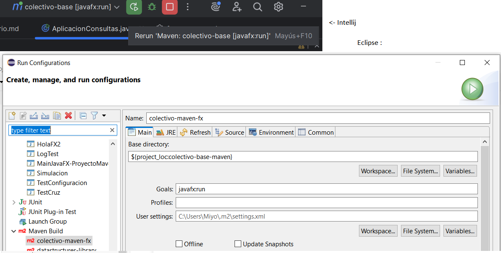
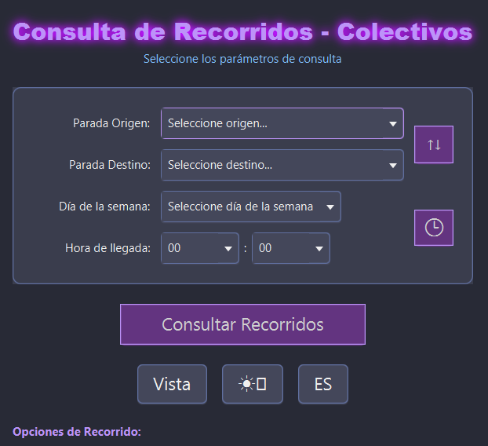
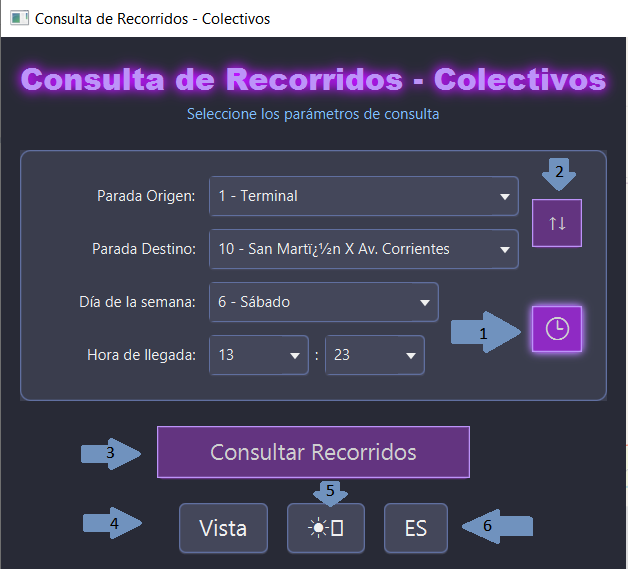
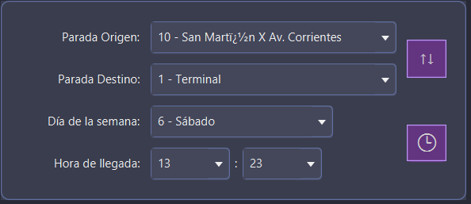
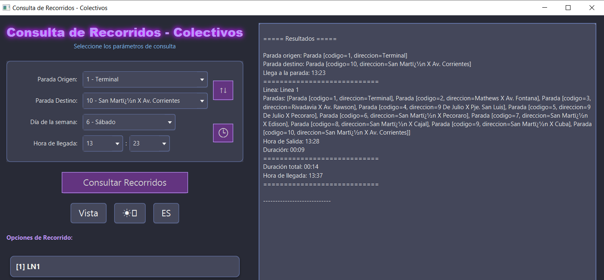
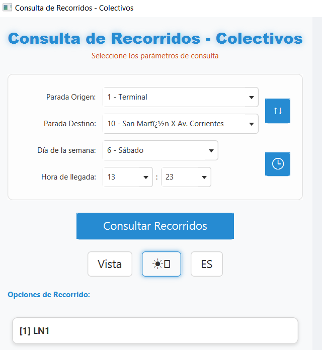
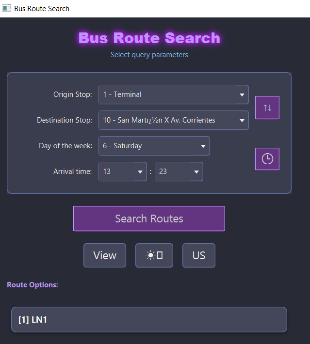

# Manual de Usuario — Versión Maven

Autores: Enzo Riera, Miyen Brandolino, Agustin Sepulveda

Profesores: Gustavo Samec, Debora Pollicelli

Fecha: 2025-11-05

Licencia: MIT (ver licencia en el repositorio)

---

## Objetivo

Documento didáctico para que estudiantes ejecuten y usen la versión con Maven del proyecto. Contiene lo esencial para poner la aplicación en marcha y realizar consultas.

## Requisitos mínimos

- Java SE 21
- JavaFX 21 (para la interfaz JavaFX)
- Maven (para ejecutar con `mvn javafx:run`)

## Configuración rápida (Maven)

1. Clonar el repositorio y posicionarse en el módulo Maven:

```bash
git clone <repo>
cd colectivo-base-maven
```

2. Ejecutar la aplicación (recomendado):

```bash
mvn javafx:run
```


> Nota: La documentación prioriza la variante Maven. El arranque con `java --module-path` se mantiene como ejemplo para Eclipse (ver sección "Eclipse: arranque manual" abajo).

## ⚙️ Configuración de la Aplicación

La aplicación utiliza **6 archivos `.properties`** en `src/main/resources/` para configurar su comportamiento. A continuación se explica cada uno:

### 1. 📄 `factory.properties` - Selección de Implementaciones ⭐ MÁS IMPORTANTE

**Define qué tecnología usar para datos e interfaz.**

**⚠️ REGLA CRÍTICA**: Descomentar **SOLO UNA** interfaz y **SOLO UN GRUPO COMPLETO** de DAOs (los 3: LINEA, PARADA, TRAMO).

```properties
# ===== INTERFAZ (descomentar SOLO UNA) =====
#INTERFAZ=colectivo.interfaz.consola.InterfazConsola
INTERFAZ=colectivo.interfaz.javafx.InterfazJavaFX

# ===== DAOs - PostgreSQL (recomendado para mapas) =====
LINEA=colectivo.dao.postgresql.LineaPostgresqlDAO
PARADA=colectivo.dao.postgresql.ParadaPostgresqlDAO
TRAMO=colectivo.dao.postgresql.TramoPostgresqlDAO

# ===== DAOs - Secuencial (archivos .txt) =====
#LINEA=colectivo.dao.secuencial.LineaSecuencialDAO
#PARADA=colectivo.dao.secuencial.ParadaSecuencialDAO
#TRAMO=colectivo.dao.secuencial.TramoSecuencialDAO

# ===== DAOs - Aleatorio (archivos .dat binarios) =====
#LINEA=colectivo.dao.aleatorio.LineaAleatorioDAO
#PARADA=colectivo.dao.aleatorio.ParadaAleatorioDAO
#TRAMO=colectivo.dao.aleatorio.TramoAleatorioDAO
```

**Combinaciones recomendadas**:
- ✅ **JavaFX + PostgreSQL** → Mapas interactivos con GPS
- ✅ **Consola + Secuencial** → Pruebas rápidas con archivos de texto
- ✅ **JavaFX + Aleatorio** → Interfaz gráfica con archivos binarios

---

### 2. 📄 `jdbc.properties` - Base de Datos PostgreSQL

**Configura conexión a PostgreSQL y selección de ciudad.**

**⚠️ REGLA**: Descomentar **SOLO UN** schema (ciudad).

```properties
usr=estudiante
pwd=estudiante
driver=org.postgresql.Driver
url=jdbc:postgresql://pgs.fi.mdn.unp.edu.ar:30000/bd1

# ===== SELECCIONAR CIUDAD (descomentar SOLO UNA) =====
schema=colectivo_PM    # Puerto Madryn
#schema=colectivo_AZL  # Azul
#schema=colectivo_CO   # Comodoro Rivadavia
#schema=colectivo_GP   # General Pico
#schema=colectivo_HL   # HonoLulu
#schema=colectivo_TW   # Trelew
```

**Uso**: Solo relevante cuando se usan DAOs PostgreSQL en `factory.properties`.

---

### 3. 📄 `secuencial.properties` - Archivos de Texto

**Define qué archivos `.txt` leer para datos de ciudades.**

**⚠️ REGLA**: Descomentar **SOLO UN CONJUNTO** de 4 archivos (una ciudad).

```properties
# ===== Puerto Madryn (comentado) =====
#linea=linea_PM.txt
#parada=parada_PM.txt
#tramo=tramo_PM.txt
#frecuencia=frecuencia_PM.txt

# ===== Trelew (activo) =====
linea=linea_TW.txt
parada=parada_TW.txt
tramo=tramo_TW.txt
frecuencia=frecuencia_TW.txt
```

**Uso**: Solo relevante cuando se usan DAOs Secuenciales en `factory.properties`.

**Importante**: Los 4 archivos deben corresponder a la misma ciudad (todos con sufijo `_TW` o todos `_PM`, etc.).

---

### 4. 📄 `aleatorio.properties` - Archivos Binarios

**Define ubicación de archivos `.dat` para acceso aleatorio.**

```properties
linea=data/linea.dat
parada=data/parada.dat
tramo=data/tramo.dat
```

**Comportamiento**:
- **Primera ejecución**: Crea archivos `.dat` automáticamente desde datos secuenciales
- **Siguientes ejecuciones**: Lee directamente de archivos binarios (más rápido)

**Uso**: Solo relevante cuando se usan DAOs Aleatorios en `factory.properties`.

---

### 5. 📄 `config.properties` - Configuración General

**Configura idioma inicial y rutas de interfaz JavaFX.**

**⚠️ REGLA**: Descomentar **SOLO UN** par de idioma (language/country).

```properties
# ===== Idioma (descomentar SOLO UN par) =====
labels=labels
language=es
country=ES
#language=en
#country=US

# ===== JavaFX (no modificar rutas) =====
vista=/colectivo/interfaz/view.fxml
estiloOscuro=/colectivo/interfaz/modoOscuro.css
estiloClaro=/colectivo/interfaz/modoClaro.css
```

**Funcionalidad de idioma**:
- **Consola**: El idioma aquí es definitivo para toda la sesión
- **JavaFX**: Es el idioma **inicial** al arrancar, pero **se puede cambiar** desde la interfaz gráfica durante la ejecución

---

### 6. 📄 `log4j2.properties` - Logging y Diagnóstico

**Controla qué mensajes se muestran en consola y archivos de log.**

```properties
# ===== Nivel de consola =====
appender.consola.filter.level.level = WARN  # Mostrar solo avisos y errores

# ===== Archivo de log diario =====
appender.infoFile.filePattern = logs/info-%d{yyyy-MM-dd}.log

# ===== Nivel general =====
rootLogger.level = info
```

**Niveles de logging** (de más detallado a menos):
- **DEBUG**: Diagnóstico detallado (ej: "Parada 123 agregada a línea XYZ")
- **INFO**: Información general (guardada en `logs/info-YYYY-MM-DD.log`)
- **WARN**: Advertencias (ej: parada no encontrada) - **por defecto en consola**
- **ERROR**: Errores críticos

**Para diagnóstico de problemas**, cambiar temporalmente:
```properties
appender.consola.filter.level.level = DEBUG
rootLogger.level = debug
```

---

## 📋 Configuraciones Comunes para Usuarios

### 🗺️ Configuración 1: Mapas Interactivos (Recomendado)

**Para visualizar recorridos en mapas con coordenadas GPS:**

```
✓ factory.properties → JavaFX + PostgreSQL
✓ jdbc.properties → Descomentar UN schema (ej: colectivo_PM)
✓ config.properties → Idioma deseado (es/ES o en/US)
✓ Requiere: Conexión a internet para cargar mapas
```

### 📄 Configuración 2: Datos desde Archivos de Texto

**Para trabajar con datos locales (Trelew en esta entrega):**

```
✓ factory.properties → Consola o JavaFX + Secuencial
✓ secuencial.properties → Descomentar archivos *_TW.txt
✓ config.properties → Idioma deseado
✓ No requiere: Conexión a base de datos ni internet
```

### 💾 Configuración 3: Archivos Binarios (Avanzado)

**Para acceso rápido con archivos binarios:**

```
✓ factory.properties → Consola o JavaFX + Aleatorio
✓ aleatorio.properties → Verificar rutas data/*.dat
✓ config.properties → Idioma deseado
✓ Nota: Primera ejecución crea archivos desde secuencial
```

## Ejecutar en Eclipse (arranque manual con JavaFX)

Solo cuando se necesite ejecutar desde Eclipse sin Maven: ajustar la Run Configuration para incluir `--module-path` apuntando al JavaFX SDK instalado y `--add-modules javafx.controls,javafx.fxml,javafx.web`.

Ejemplo (VM arguments):

```text
--module-path "E:\\javafx-sdk-21.0.8\\lib" --add-modules javafx.controls,javafx.fxml,javafx.web
```

## Uso básico de la aplicación

La aplicación permite realizar consultas de recorridos entre paradas. Desde la interfaz (consola o JavaFX) el usuario debe indicar:

- parada origen (código numérico)
- parada destino (código numérico)
- día de la semana (1–7)
- hora de llegada deseada (HH:MM)
La aplicación devolverá las opciones disponibles (directas, con transbordo, combinando caminatas) y detalles por segmento.




1. El boton con Simbolo de Reloj completa el dia y hora actual en los campos correspondientes.
2. El boton de intercambio los campos de origen y destino.
3. Consulta de recorrido.
4. Cambiar  Vista: Mapa con coordenadas GPS o Lista de Paradas.
5. Cambiar Vista : Modo Oscuro (por Defecto) o Claro.!
6. Cambiar Idioma : aun sin cambiar la configuracion, se puede cambiar de idioma. Hay que volver a realizar la consulta. 


## 🔧 Solución de Problemas Comunes

### Error: "ClassNotFoundException" o "No se carga la interfaz/DAO"

**Causa**: Múltiples implementaciones descomentadas o ninguna seleccionada en `factory.properties`

**Solución**:
1. Abrir `src/main/resources/factory.properties`
2. Verificar que hay **SOLO UNA** línea `INTERFAZ=...` sin comentar
3. Verificar que hay **SOLO UN GRUPO** de DAOs sin comentar (los 3: LINEA, PARADA, TRAMO deben ser de la misma implementación)
4. Reiniciar la aplicación

### Error: "No se conecta a la base de datos" / "Schema not found"

**Causa**: Configuración incorrecta en `jdbc.properties`

**Solución**:
1. Abrir `src/main/resources/jdbc.properties`
2. Verificar que **SOLO UNA** línea `schema=...` está sin comentar (las demás deben tener `#`)
3. Verificar credenciales (`usr=estudiante`, `pwd=estudiante`)
4. Verificar conectividad de red al servidor PostgreSQL
5. Reiniciar la aplicación

### Error: "Archivo no encontrado" (linea_XX.txt, parada_XX.txt, etc.)

**Causa**: Archivos no coinciden entre `secuencial.properties` y los disponibles

**Solución**:
1. Abrir `src/main/resources/secuencial.properties`
2. Verificar que los 4 archivos descomentados corresponden a la **misma ciudad** (mismo sufijo: `_PM`, `_TW`, etc.)
3. Verificar que los archivos `.txt` existen en `src/main/resources/`
4. No mezclar archivos de diferentes ciudades (ej: `linea_PM.txt` con `parada_TW.txt` es INCORRECTO)

### Error: El mapa no se visualiza o muestra error de WebView

**Verificar**:
1. ✅ `factory.properties` tiene `INTERFAZ=...InterfazJavaFX` y DAOs PostgreSQL activos
2. ✅ `jdbc.properties` tiene UN schema descomentado
3. ✅ Conexión a internet activa (para cargar tiles de OpenStreetMap)
4. ✅ JavaFX 21 instalado con módulo `javafx.web`
5. ✅ VM arguments incluyen `--add-modules javafx.controls,javafx.fxml,javafx.web`

### La aplicación arranca en inglés cuando debería estar en español (o viceversa)

**Causa**: Idioma mal configurado en `config.properties`

**Solución**:
1. Abrir `src/main/resources/config.properties`
2. Para **español**, descomentar:
   ```properties
   language=es
   country=ES
   ```
   Y comentar las líneas de inglés (`#language=en`, `#country=US`)
3. Para **inglés**, hacer lo contrario
4. Reiniciar la aplicación (o cambiar idioma desde el menú en JavaFX)

### Veo muchos mensajes en la consola / No veo mensajes de debug

**Causa**: Nivel de logging no configurado apropiadamente

**Solución para VER más mensajes (debugging)**:
1. Abrir `src/main/resources/log4j2.properties`
2. Cambiar:
   ```properties
   appender.consola.filter.level.level = DEBUG
   rootLogger.level = debug
   ```
3. Reiniciar la aplicación

**Solución para VER menos mensajes (producción)**:
1. Cambiar a:
   ```properties
   appender.consola.filter.level.level = WARN
   rootLogger.level = info
   ```

### Java o JavaFX no encontrados

**Causa**: Variables de entorno o rutas incorrectas

**Solución**:
- Verificar `JAVA_HOME` configurado
- Ejecutar `java -version` (debe mostrar Java 21+)
- Si ejecuta sin Maven: verificar que `--module-path` apunte a JavaFX SDK instalado
- **Recomendado**: Usar `mvn javafx:run` para evitar problemas de rutas

### La aplicación con DAOs Aleatorios no encuentra los archivos .dat

**Causa**: Primera ejecución o rutas incorrectas

**Solución**:
1. Verificar `src/main/resources/aleatorio.properties` tenga:
   ```properties
   linea=data/linea.dat
   parada=data/parada.dat
   tramo=data/tramo.dat
   ```
2. Verificar que existe el directorio `data/` en la raíz del proyecto
3. Si es primera ejecución, los archivos se crearán automáticamente desde datos secuenciales
4. Verificar que los DAOs Secuenciales tienen datos válidos para poblar los `.dat`

## Tests proporcionados por la cátedra

Los tests que provee la cátedra (ubicados en `src/test/java`, paquete `colectivo.test`) son ejecutables con cualquier DAO siempre que la ciudad de test esté configurada a Puerto Madryn en los recursos de test. Los tests relevantes son:

- `TestCalcularRecorridoDAO`
- `TestCalcularRecorrido`

## Soporte y contacto


Repositorios y autores:

- [https://github.com/MiyoBran](https://github.com/MiyoBran)
- [https://github.com/agussepu](https://github.com/agussepu)
- [https://github.com/EnzoRiera](https://github.com/EnzoRiera)

---
